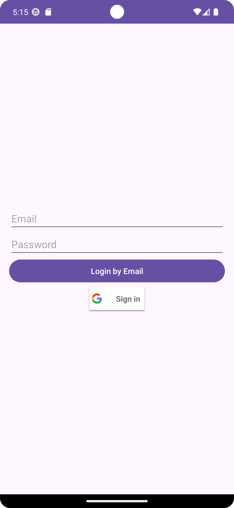
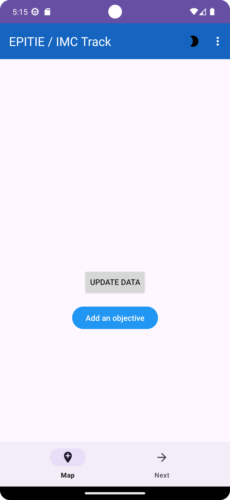
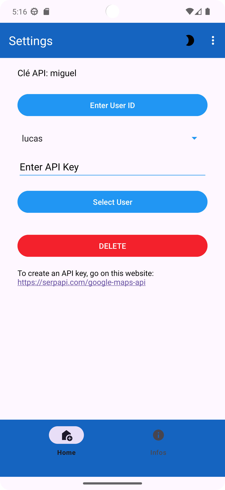
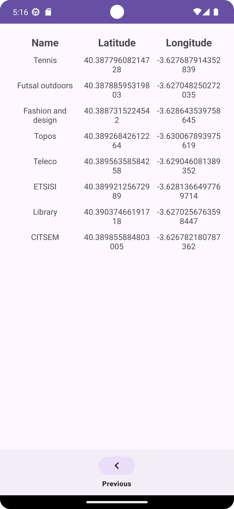
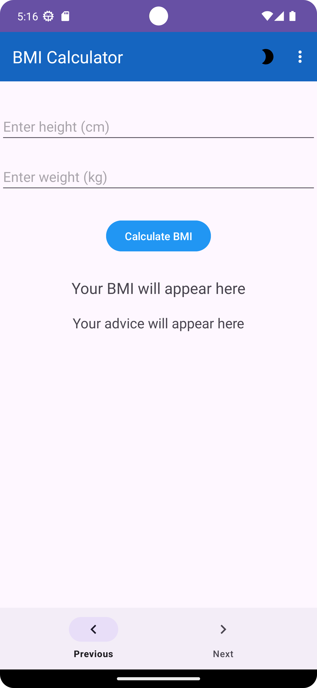
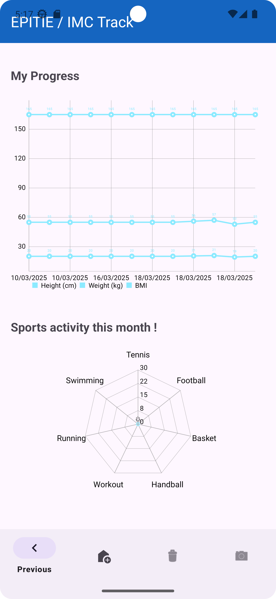
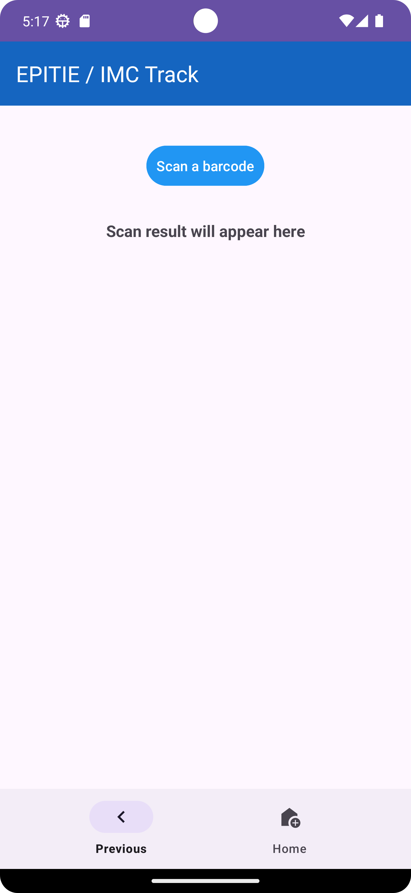

# IMCTrack

## Github
- Repository : [IMCTrack](https://github.com/lucasbnrd05/epitie)
- Releases : [Releases](https://github.com/lucasbnrd05/epitie/releases)

## Workspace
- [Sharepoint](https://upm365.sharepoint.com/:u:/r/sites/epitie/SitePages/Tracking.aspx?csf=1&web=1&share=Efsjl89nsdZOqjWHYzD16RgBEHoe9oesrnNQVink2C_l2A&e=OLGwYe)

## Description
**IMCTrack** is an Android mobile application designed to calculate Body Mass Index (BMI) and provide personalized health tips based on the results. The app offers users a simple and intuitive interface to track their BMI over time, helping them monitor their progress and maintain a healthy lifestyle. With features such as progress history and tailored advice, **IMCTrack** serves as a practical tool for anyone looking to understand and improve their body health.

### Environmental Impact & Justification
IMCTrack is not just a tool for tracking health; it also promotes environmental awareness and sustainability. By encouraging users to engage in physical activity outdoors, the application indirectly contributes to improving air quality and reducing respiratory health risks. Access to a map showing outdoor sports locations helps users find green spaces, parks, and fitness areas, reinforcing the importance of maintaining and protecting natural environments in urban settings.

Furthermore, the food scanner feature plays a role in promoting responsible consumption by allowing users to make informed dietary choices. By understanding the nutritional composition of food, users can reduce waste and support more sustainable food practices. This, in turn, helps mitigate food shortages and biodiversity loss by encouraging a balanced diet and responsible resource use.

The application also incorporates an environmental education aspect by integrating personalized health objectives that align with sustainable living habits. Encouraging regular exercise and outdoor activities reduces sedentary behaviors, indirectly fostering better adaptation to extreme weather events, such as heatwaves and pollution spikes. Additionally, the ability to locate natural water sources, such as fountains and canals, further enhances the user’s connection to a healthier, greener environment.

By providing users with tools to monitor their progress and set fitness goals, IMCTrack fosters a proactive approach to well-being that aligns with ecological sustainability. The integration of location-based services ensures that users can find the best places to exercise while contributing to the broader conversation about urban renaturalization and the importance of preserving open natural spaces.

## Screenshots and navigation

| Page | Screenshot | Description |
|------|-----------|-------------|
| **Home Page** |  | Login page. |
| **First Page** | | Home page with quick access to the main functions. |
| **Settings Page** | | Interface for modifying user information. |
| **Position Page** | | Interface for locating nearby sports venues. |
| **BMI Page** | | Interface for calculating and displaying the user's BMI. |
| **Charts Page** |  | Interface for displaying the user's BMI and physical activity. |
| **Scanning Page** | | Interface for scanning items. |

## Demo video

  

## Our Website
🔗 [See our landing page](https://lucasbnrd05.github.io/imctrack/index.html)

## Features
- **BMI Calculation & Tracking**: Users can calculate their BMI and monitor progress through graphical representation.
- **Goal Setting**: Users can define personal fitness and health objectives.
- **Progress Charts**: Display BMI trends over time.
- **Food Scanner**: Analyze nutritional content of food items to make healthier choices.
- **Interactive Map**: Locate nearby outdoor fitness areas, parks, and sports centers.
- **Multi-Device Synchronization**: Users can log in via Google or email, allowing access from multiple devices.
- **API Key Management**: Users can generate a personalized API key to optimize location-based features.

### Technical Features
- Persistence in CSV/Text file  
- Persistence in Room database, to store the running data.   
- Firebase Realtime Database, to store user data.  
- Firebase Authentication. 
- Maps: OpenStreetMap. 
- Resful APIs used: OpenStreetMap. 
- Menu: Navigation Drawer (Version 2025). 
- Version 2024:  
  - Bottom navigation menu.   
  - Toolbar. Ref: Source code  
- ListViews. Ref: Source code  
- Sensors: GPS coordinates. 
- Images: Glide. 
- Customizable markers with icon + text and map tiles. 
- Add markers with current location. 
- Create routes to connect markers. 
- Shared Preferences for storing API keys. 
- File storage (read and write). 
- Timestamp and altitude recording. 
- Switch button to activate location tracking. 
- Customizable icons. 
- Add SharedPreferences activity. 
- RESTful API for external services.

## How to use
1. **Download & Install**:
   - Clone the repository or download the latest release from [GitHub Releases](https://github.com/lucasbnrd05/epitie/releases).
   - Install the application manually on your Android device.
2. **Launch the Application**:
   - Open the app and log in with Google or email.
   - If you don’t have an account, one will be created automatically.
3. **Navigation**:
   - The bottom navigation bar allows movement between pages.
   - The three-dot menu in the top right corner provides additional options.
4. **Using the App**:
   - **Home Page**: Set or remove personal fitness goals.
   - **BMI Calculator (Page 2)**: Enter height and weight to compute BMI; results are saved automatically.
   - **Progress Tracking (Page 3)**: View BMI history and trends via charts.
   - **Food Scanner**: Accessible from the tracking page to analyze food items.
   - **Interactive Map**: Found on the home page, displays nearby fitness locations.
   - **Settings & API Key Management**: Accessible from the three-dot menu for customizing location-based recommendations.
   - **Logout**: Available via the three-dot menu.

## Participants
## List of MAD developers:
- **Lucas BERNARDEAU** (lucas.bernardeau@alumnos.upm.es)
- **Nathan VANATHATHAN** (nathan.vanathathan@alumnos.upm.es)
- **Dina DIDOUCHE** (dina.didouche@alumnos.upm.es)

**Workload distribution**: (33% / 33% / 33%).

